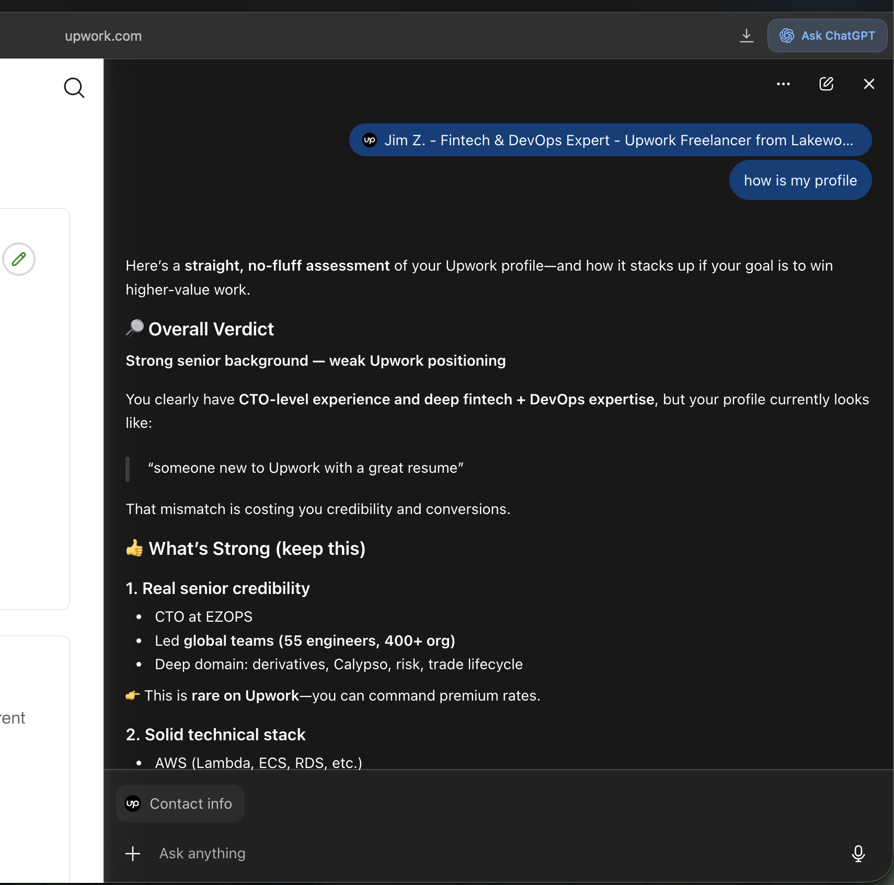
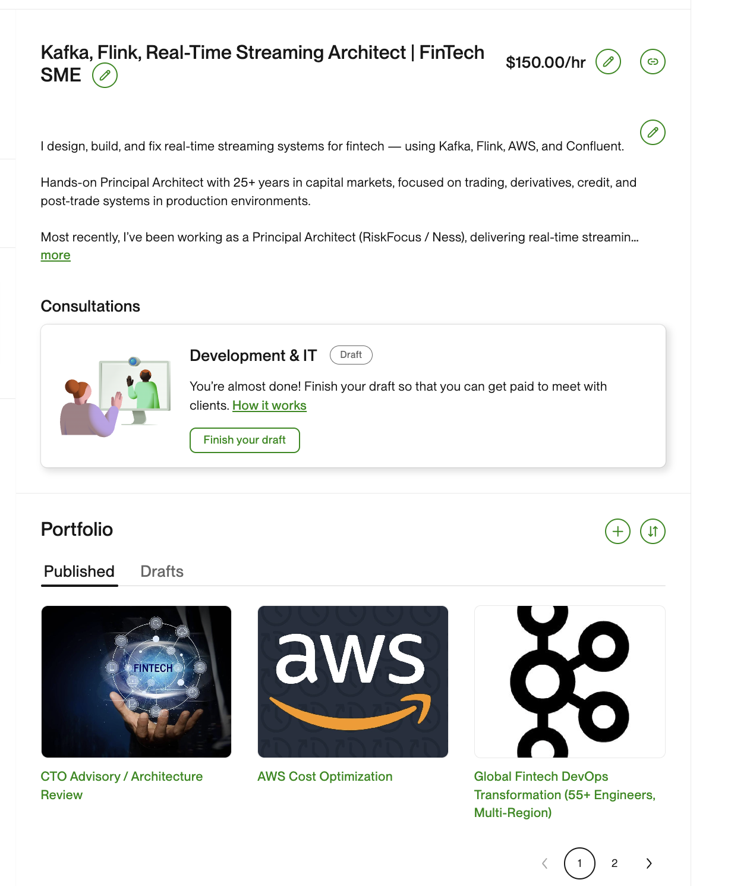

# Build a High-Converting Upwork Profile (Using Atlas)

This guide shows how to create a strong Upwork profile using the ChatGPT Atlas browser, trained on your LinkedIn profile and resume.

---

## 🚀 Goal

Create an Upwork profile that:

* Clearly communicates **what you do**
* Targets the **right clients**
* Converts profile views into **messages and jobs**

---

## ⚙️ Step 1: Set Up Atlas

Access the ChatGPT Atlas browser:

* Go to **Settings**
* Open **Labs / Experimental Features**
* Enable **Atlas Browser**

---

## 📄 Step 2: Train Atlas on You

Provide context so Atlas can generate personalized content:

* 📄 Resume
* 🔗 LinkedIn profile
* 🧠 Key projects, skills, and experience

💡 *The more context you provide, the better the results.*

---

## 🧱 Step 3: Build Your Profile (Section by Section)

### 1. Headline

Ask Atlas:

> “Create a high-converting Upwork headline for me”

✅ Goal:

* Be **client-focused**
* Include **target niche**
* Show **clear value**

---

### 2. Summary

Ask Atlas:

> “Write an Upwork summary that focuses on outcomes and client value”

✅ Include:

* What you help clients achieve
* Key accomplishments (with metrics if possible)
* Technologies (briefly)
* Call to action

---

### 3. Skills

Ask Atlas:

> “Suggest the top 10 skills I should list for Upwork”

✅ Focus on:

* Searchable keywords
* Your strongest, most relevant capabilities

---

### 4. Portfolio

Ask Atlas:

> “Suggest 3 strong portfolio projects based on my background”

✅ Include:

* Real or reconstructed projects
* Clear problem → solution → outcome
* Business impact

---

## 🔍 Step 4: Review and Refine

Ask Atlas to critique your profile:

> “Review my Upwork profile and suggest improvements”

Iterate until:

* Messaging is clear
* Positioning is strong
* Profile feels client-focused

---

## 📸 Example: Initial Atlas Feedback

  

---

## 🔄 Before vs After (Key Improvement)

### Before

> DevOps Consultant | AWS, CI/CD, Cloud Infrastructure

* Generic
* Tool-focused
* No clear target client

---

### After

> I Help Fintech Firms Build Scalable Trading & Cloud Platforms

* Clear niche (fintech)
* Outcome-focused
* Strong positioning

---

## 💡 Key Tips

* Think like a **client**, not a candidate
* Focus on **results**, not responsibilities
* Be specific about **who you help**
* Keep refining — this is iterative

---

## ✅ Final Checklist

* [ ] Headline is clear and targeted
* [ ] Summary focuses on outcomes
* [ ] Skills match your niche
* [ ] Portfolio shows real impact
* [ ] Profile passes the “would I hire this person?” test

---

Use this process anytime you want to reposition yourself or target higher-paying clients on Upwork.

---

# Example

[Jim Upwork Profile](https://www.upwork.com/freelancers/~0193b2f3358763a5ec)

